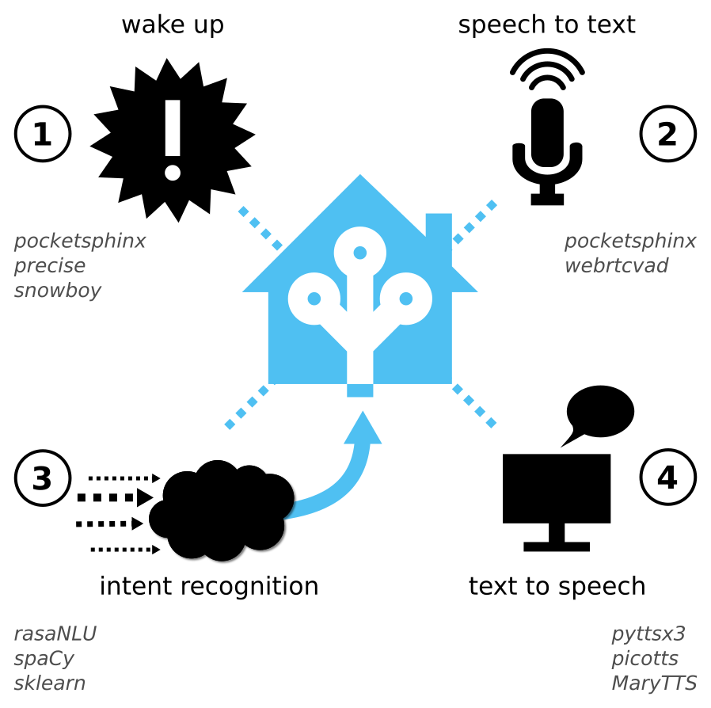

rhasspy Voice Assistant Toolkit
======================================

rhasspy is a toolkit for developing custom voice assistants, hosted in the [Home
 Assistant](https://www.home-assistant.io/) platform. It can run on a [Raspberry
 Pi](https://www.raspberrypi.org/) or other modest hardware.

This project was inspired by [Jasper](https://jasperproject.github.io/), a voice
assistant developed by students at Princeton. Like Jasper, rhasspy is open
source, built entirely from free software, and is intended to run on modest
off-the-shelf hardware. However, there are some important differences that set
rhasspy apart from Jasper and other voice assistants (Alexa, Google Home, etc.):

* **Offline by Default**
    * rhasspy is designed to run *without an internet connection*, and without
      requiring the user to sign up for any 3rd party services. The option is
      there, however, if better accuracy is needed (such as using the
      [snowboy](https://snowboy.kitt.ai/) hotword detector).
* **Hosted in Home Assistant**
    * rhasspy is not a standalone piece of software, but exists as a set of
      resuable *Home Assistant components* that connect directly to Home
      Assistant's [intent
      system](https://developers.home-assistant.io/docs/en/intent_index.html).
      This gives rhasspy access to hundreds of
      [components](https://www.home-assistant.io/components/) out of the box,
      and lets users incorporate only the pieces of rhasspy they're interested
      in.
* **Modern Tools and Techniques**
    * Jasper used [pocketsphinx](https://github.com/cmusphinx/pocketsphinx) for
      keyword matching on a small set of user-defined keywords. rhasspy instead
      takes a (possibly large) set of [annotated training
      phrases](https://nlu.rasa.com/dataformat.html), and uses them to both
      generate a [language model](https://cmusphinx.github.io/wiki/tutoriallm/)
      and train an [intent recognizer](https://nlu.rasa.com/). In order to
      accomodate flexible speech input, the generated language model is "mixed"
      with [CMU's base English
      model](https://sourceforge.net/projects/cmusphinx/files/Acoustic%20and%20Language%20Models/US%20English/).
      
      

  

Overview
----------

rhasspy provides a set of custom components for Home Assistant, which depend on
the tools found in
[rhasspy-tools](https://github.com/synesthesiam/rhasspy-tools). There are
[several
quickstarts](https://github.com/synesthesiam/rhasspy-assistant/tree/master/doc)
that describe the installation process in detail for different scenarios. In
general, the installation process involves:

1. Installing system dependencies for building Python libraries
2. Installing Home Assistant (if you don't have it yet)
3. Downloading
   [rhasspy-assistant](https://github.com/synesthesiam/rhasspy-assistant) and
   [rhasspy-tools](https://github.com/synesthesiam/rhasspy-tools)
4. Copying custom components and configuration files from `rhasspy-assistant` to
   your Home Assistant configuration directory
5. Editing the `configuration.yaml` and `automations.yaml` to set the
   appropriate paths to `rhasspy-tools` and `rhasspy-assistant`
6. Restarting Home Assistant and waiting for all the dependencies to install
    * `PyAudio` and `spaCy` seem to take the longest
7. Downloading a `spaCy` language model and linking it
    * For example: `python3 -m spacy download en`

Once you have rhasspy installed and working, you can add new training phrases
and intents by editing the examples markdown file(s) pointed to by your
`rhasspy_train` component configuration. These files are in [rasaNLU's markdown
training format](https://nlu.rasa.com/dataformat.html#markdown-format), and are
used to (1) generate a
[dictionary](https://cmusphinx.github.io/wiki/tutorialdict/) and [language
model](https://cmusphinx.github.io/wiki/tutoriallm/) for pocketsphinx, and (2)
train an [intent recognizer](https://nlu.rasa.com/) that will trigger [intents
inside Home Assistant](https://www.home-assistant.io/components/intent_script).

Home Assistant Components
------------------------------

rhasspy provides the following custom components for Home Assistant. They can be
mixed and matched to fit a number of scenarios, including running everything on
a single machine, a Raspberry Pi, or a client and server.

* `rhasspy_train`
    * Exposes a service to re-train the intent and speech recognizers that rhasspy uses
    * Takes user-provided training examples in Markdown as input
    * Guesses pronunciations of unknown words
* `stt_pocketsphinx.py`
    * Speech to text with [pocketsphinx](https://github.com/cmusphinx/pocketsphinx)
    * Voice activity detection with [webrtcvad](https://webrtc.org)
    * Audio input from [PyAudio](https://people.csail.mit.edu/hubert/pyaudio) or WAV file
* `rasa_nlu.py`
    * Intent recognition from text using [rasaNLU](https://nlu.rasa.ai/) and [spaCy](https://spacy.io)
    * Offline training available from Markdown data files
    * Utilizes Home Assistant's own [intent system](https://www.home-assistant.io/components/intent_script)
* `hotword_pocketsphinx.py`
    * Hotword detection with [pocketsphinx](https://github.com/cmusphinx/pocketsphinx)
    * No training required to change hotword
    * Highest false positive rate
* `hotword_precise.py`
    * Hotword detection with [Mycroft Precise](https://github.com/mycroftai/mycroft-precise)
    * Offline training available for custom hotwords
    * Medium/low false positive rate (depends on training)
* `hotword_snowboy.py`
    * Hotword detection with [Snowboy](https://snowboy.kitt.ai)
    * Online training available with 3rd party account for custom hotwords
    * Low false positive rate

For special cases, these components are also available:

* `command_listener.py`
    * Voice activity detection with [webrtcvad](https://webrtc.org)
    * Audio input from [PyAudio](https://people.csail.mit.edu/hubert/pyaudio)
    * Audio output to WAV file
    * Used when speech to text is done on a different machine from where audio is recorded
* `picotts_aplay.py`
    * Text to speech with [picoTTS](https://en.wikipedial.org/wiki/SVOX)
    * Output is locally played with [aplay](https://linux.die.net/man/1/aplay)
    * Better results over HDMI on Raspberry Pi than [tts.picotts](https://www.home-assistant.io/components/tts.picotts)
* `tts_pyttsx3.py`
    * Text to speech with [pyttsx3](https://pypi.org/project/pyttsx3/)
    * Uses [espeak](http://espeak.sourceforge.net) on Linux
    * Uses native text to speech systems on Windows/MacOS
* `wav_aplay.py`
    * Plays a WAV file is locally played with [aplay](https://linux.die.net/man/1/aplay)
    * Better results over HDMI on Raspberry Pi than [media_player.vlc](https://www.home-assistant.io/components/media_player.vlc)

Software Requirements
--------------------------

* Linux (tested on Ubuntu 16.04 and Raspbian 2018-04)
* Python 3.5.3 or later
* Home Assistant

Hardware Requirements
--------------------------

* Microphone
    * The [Playstation 3 Eye](https://en.wikipedia.org/wiki/PlayStation_Eye) works great and is quite cheap
* Computer
    * Raspberry Pi 3 is slow, but works
    * Any desktop computer or server that can run Linux (`armv7l` or `x86_64`)

Running rhasspy
------------------

rhasspy is just a collection of Home Assistant components, so it runs when
you've copied the custom components to your configuration directory (sometimes
`~/.homeassistant`) and added the appropriate entries to your
`configuration.yaml` file.

At a minimum, you'll want `rhasspy_train`, `stt_pocketsphinx`, and one of the
`hotword` components (like `hotword_precise`). The configuration files in
`config/examples` show examples of configuring these components.

The biggest configuration comes from `rhasspy_train`. In the `single_machine`
example, it looks like this:

    rhasspy_train:
      ngram_path: $RHASSPY_TOOLS/srilm/bin/x86_64/ngram
      ngram_count_path: $RHASSPY_TOOLS/srilm/bin/x86_64/ngram-count
      phonetisaurus_path: $RHASSPY_TOOLS/phonetisaurus/phonetisaurus-x86_64
      phonetisaurus_fst: $RHASSPY_TOOLS/phonetisaurus/etc/g014b2b.fst
      project_dir: $RHASSPY_ASSISTANT/data/projects
      example_files:
        - $RHASSPY_ASSISTANT/data/examples.md
      rasa_config: $RHASSPY_ASSISTANT/etc/rasa/config_spacy.yml
      dictionary_files:
        - $RHASSPY_TOOLS/pocketsphinx/cmudict-en-us.dict
      dictionary_guess: $RHASSPY_ASSISTANT/data/guess.dict
      dictionary_mixed: $RHASSPY_ASSISTANT/data/mixed.dict
      language_model_base: $RHASSPY_TOOLS/pocketsphinx/en-70k-0.2-pruned.lm
      language_model_example: $RHASSPY_ASSISTANT/data/examples.lm
      language_model_mixed: $RHASSPY_ASSISTANT/data/mixed.lm
      
To make this work, you have to first replace `$RHASSPY_ASSISTANT` with the path
to where you cloned `rhasspy-assistant` (this repo) and replace `$RHASSPY_TOOLS`
with the path to where you cloned
[rhasspy-tools](https://github.com/synesthesiam/rhasspy-tools).

Importantly, the example `automations.yaml` file defines rules for Home
Assistant that pass information between rhasspy's components. These are critical
for ensuring that rhasspy listens for the wake word on startup, listens for
commands when woken up, and passes commands to the intent recognizer.

Training
----------

Once you have rhasspy configured and running, you can extend it by adding new
training phrases. By default, these are stored in Markdown format in
`rhasspy-assistant/data/examples.md`. Examples are broken down by intent, so

    ## intent:HassTurnOff
    - turn off the [living room lamp](name)
    - turn off [living room lamp](name)
    - turn off the [garage light](name)
    - turn off [garage light](name)
    
provides 4 examples for the `HassTurnOff` intent. The names on the intents and
slots map directly to [Home Assistant's intent
system](https://developers.home-assistant.io/docs/en/intent_index.html). You can
easily define your own intents by adding an
[intent_script](https://www.home-assistant.io/components/intent_script/)
configuration and making sure the name matches (e.g., `GetTemperature` under
`intent_script` matches `## intent:GetTemperature` in `examples.md`).

Whenever you modify your examples, you need to re-train rhasspy by calling the
`rhasspy_train.train` service (either from the Home Assistant frontend or via a
REST call). Watch the logs carefully for errors, and check
`rhasspy-assistant/data` to make sure new `mixed.dict` and `mixed.lm` files are
created. A `guess.dict` file will be generated with pronunciations of unknown
words. Add these to the main dictionary file if you're happy with them (see
[this tutorial](https://cmusphinx.github.io/wiki/tutorialdict/) for more
information).

MaryTTS
---------

I think the MaryTTS text to speech system sounds better than picoTTS for offline
use. Below is my guide for installing MaryTTS and some additional voices. This
is **not** recommended for the Raspberry Pi, due to its limited RAM.

Start by downloading the MaryTTS sources:

    mkdir -p download
    wget -O download/marytts-5.2.zip https://github.com/marytts/marytts/releases/download/v5.2/marytts-5.2.zip
    unzip download/marytts-5.2.zip
    
After unzipping, you can run the MaryTTS server (assuming you have `java` in your `PATH`):

    marytts-5.2/bin/marytts-server
    
Additional voices can be found [on Github](https://github.com/marytts). 
For example, the Prudence (British Female) voice can be installed as follows:

    wget -O marytts-5.2/download/voice-dfki-prudence-hsmm-5.2.zip https://github.com/marytts/voice-dfki-prudence-hsmm/releases/download/v5.2/voice-dfki-prudence-hsmm-5.2.zip
    unzip -d marytts-5.2 marytts-5.2/download/voice-dfki-prudence-hsmm-5.2.zip
    
Be careful to only install the voices you need. MaryTTS seems to load them all
into RAM up front, so a Raspberry Pi will run out of room quickly. If you want
to install all of the English voices, do the following:

    for voice in dkfi-prudence dfki-poppy dfki-obadiah dfki-spike cmu-bdl cmu-rms; do
      wget -O marytts-5.2/download/voice-$voice-hsmm-5.2.zip https://github.com/marytts/voice-$voice-hsmm/releases/download/v5.2/voice-$voice-hsmm-5.2.zip;
      unzip -d marytts-5.2 marytts-5.2/download/voice-$voice-hsmm-5.2.zip;
    done
    
Add the [marytts
platform](https://www.home-assistant.io/components/tts.marytts/) to your
`configuration.yaml` file in Home Assistant.
